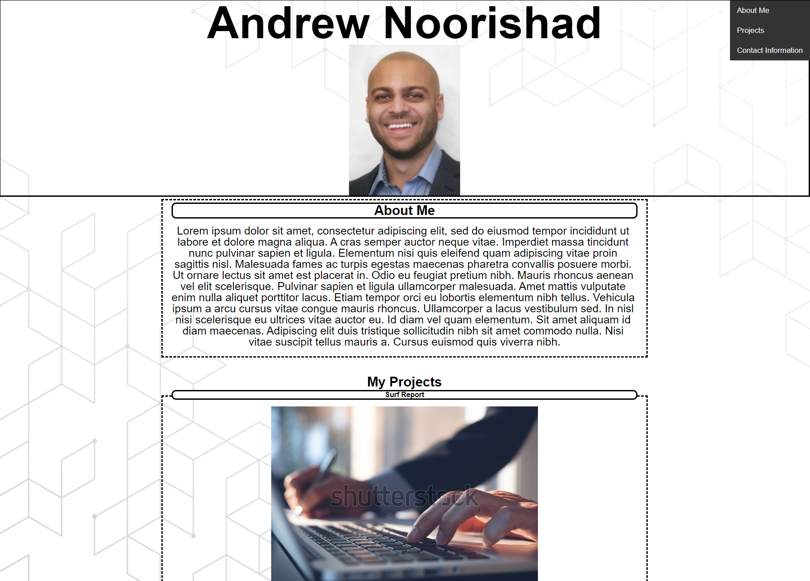

# Personal-Portfolio

## Purpose

Web page built from scratch to showcase samples of personal projects to potential employers.

## Features

* Presents developer's name, a recent photo, and links to sections about them, their work, and how to contact them
* UI scrolls to the corresponding section when one of the links is clicked
* First sample appilication's image is larger in size than the others
* When the images are clicked, user is taken to that deployed application (placeholder link currently in place)
* Layout is response and adapts to viewport

## Mock-Up
The following screenshot shows the web application's appearance

